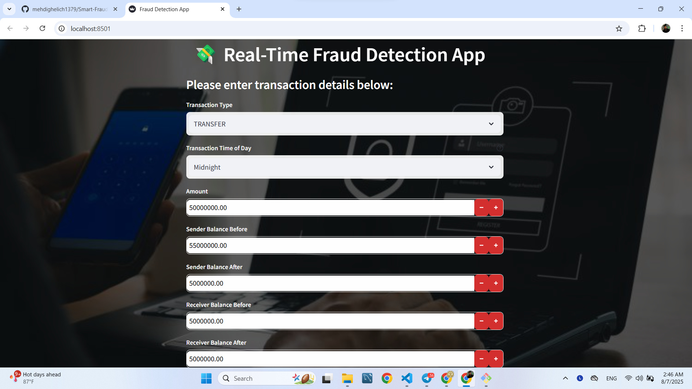

# 💳 Smart Fraud Detection Pipeline  
Detecting fraudulent financial transactions using feature engineering, LightGBM, CatBoost, SMOTE, and evaluation visualizations.

---

## 🔗 Live Demo

You can try the app live here:  
🌐 [Click to open Smart Fraud Detection App](https://smart-fraud-detection-mehdighelich.streamlit.app/)

---

## 📷 Demo Screenshots

### 📥 Transaction Input Form


### 📊 Prediction Output


---

## 📁 Project Structure

```bash
fraud-detection/
├── data/                             ← (optional) zipped dataset or ignored raw data
├── images/                           ← Images used in reporting or Streamlit
├── mlruns/                           ← MLFlow tracking (excluded from Git)
├── notebook/
│   ├── EDA.ipynb                     ← Exploratory Data Analysis
│   ├── build_model.ipynb            ← Step-by-step experimentation
│   └── sampled_5m_with_fraud.csv    ← Sample dataset (if not ignored)
├── src/
│   ├── data/
│   │   └── preprocessing.py         ← Preprocessing + feature engineering
│   ├── models/
│   │   ├── train_model.py           ← Model training script
│   │   └── *.pkl                    ← Saved models (CatBoost / LGBM)
│   ├── utils/
│   │   └── metrics.py               ← Evaluation metrics and plots
│   └── init.py
├── app.py                           ← Streamlit dashboard entry point
├── explainder_dashboard.py          ← SHAP + feature importance visualizer
├── evaluate.py                      ← Model evaluation and reporting
├── main.py                          ← Full training pipeline
├── requirements.txt
└── README.md
🧠 Key Highlights
✅ End-to-End Pipeline:
Covers everything from EDA to deployment-ready models

Modular and production-oriented design using src/ architecture


📈 Model Types:
LightGBM with tuned parameters

CatBoost for additional benchmarking

⚙️ Feature Engineering:
Created custom features to capture transaction behavior and anomalies:

python
Copy
Edit
errorBalanceOrig = newbalanceOrig + amount - oldbalanceOrg
errorBalanceDest = oldbalanceDest + amount - newbalanceDest
diffOrig = oldbalanceOrg - newbalanceOrig
diffDest = newbalanceDest - oldbalanceDest
is_orig_empty_after = (newbalanceOrig == 0).astype(int)
is_dest_empty_before = (oldbalanceDest == 0).astype(int)
large_amount_flag = (amount > amount.quantile(0.99)).astype(int)
ratio_amount_balance = amount / (oldbalanceOrg + 1)
These features help the model capture unusual behaviors like:

Sender/receiver having empty balances

Large transaction amounts

Mismatches between expected and actual balances

Also:

The step column is dropped if present

The time_period feature (e.g. "Morning", "Afternoon") is required

🚦 Evaluation
Metric	Score
Accuracy	~0.99
Precision	~0.99
Recall	~0.99
F1-Score	~0.99

Validated using 5-fold Stratified Cross-Validation

Visualized using confusion matrix, ROC AUC, and precision-recall curves

📊 Visual Tools
explainder_dashboard.py: SHAP-based feature importance visualizer

evaluate.py: Generates evaluation and performance plots

app.py: Real-time prediction dashboard with Streamlit

🚀 Getting Started
bash
Copy
Edit
# 1. Clone the repository
git clone https://github.com/mehdighelich1379/Smart-Fraud-Detection.git
cd Smart-Fraud-Detection

# 2. Install dependencies
pip install -r requirements.txt

# 3. Run the full pipeline
python main.py

# 4. (Optional) Evaluate the model
python evaluate.py
🛠️ Tech Stack
Languages & Tools: Python, Jupyter, VS Code
ML Libraries: LightGBM, CatBoost, Scikit-learn, SMOTE
Visualization: Matplotlib, Seaborn, SHAP
Experiment Tracking: MLflow
Web Interface: Streamlit

📝 Final Thoughts
This pipeline demonstrates how a structured, iterative approach — especially domain-informed features — can drastically improve fraud detection performance even with imbalanced data.


The setup is modular, production-ready, and can be adapted for other anomaly or outlier detection use cases as well.
