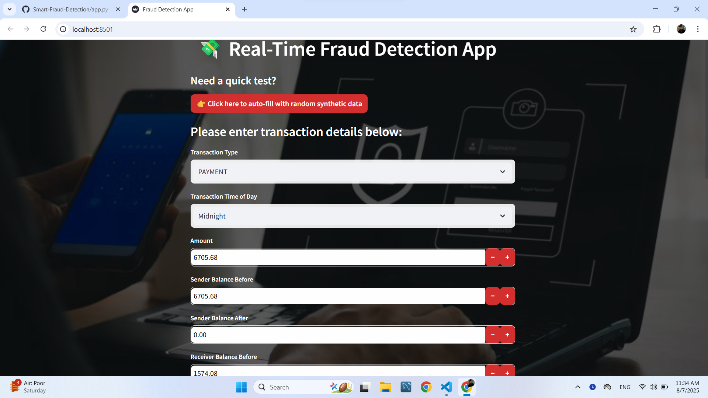
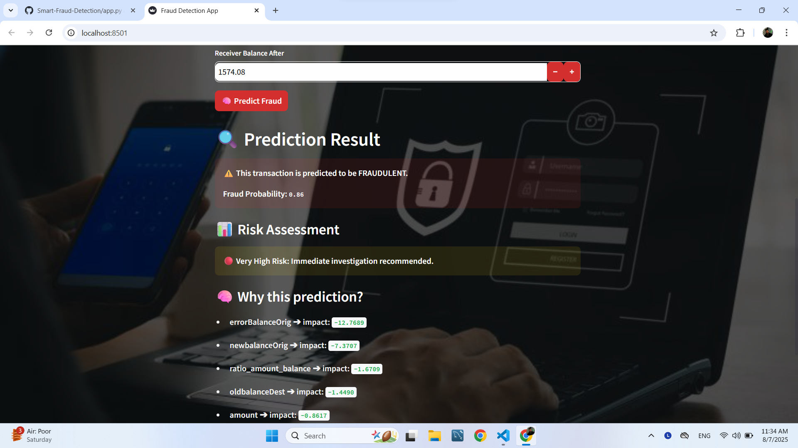
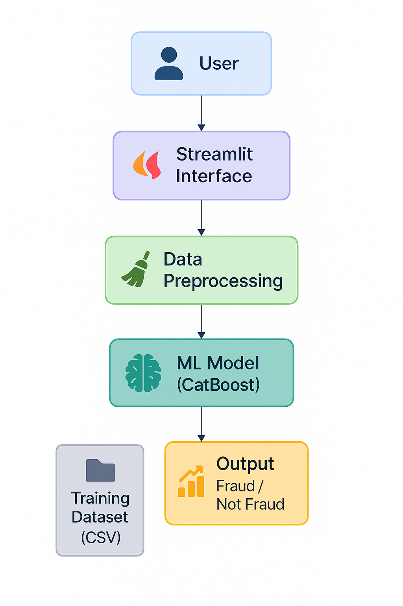

# 💳 Smart Fraud Detection Pipeline  


📊 **Dataset Info**  
Model trained on a real-world dataset with **~6 million legitimate transactions** and **~9,000 fraudulent cases** — showcasing severe class imbalance (~0.15% fraud rate).


Detecting fraudulent financial transactions using feature engineering, LightGBM, CatBoost, SMOTE, and evaluation visualizations.

---

## 🔗 Live Demo

You can try the app live here:  
🌐 [Click to open Smart Fraud Detection App](https://smart-fraud-detection-mehdighelich.streamlit.app/)

---

## 📷 Demo Screenshots

### 📥 Transaction Input Form


### 📊 Prediction Output


---

## 📁 Project Structure
```bash
fraud-detection/
├── data/                             ← (optional) zipped dataset or ignored raw data
├── images/                           ← Images used in reporting or Streamlit
├── mlruns/                           ← MLFlow tracking (excluded from Git)
├── notebook/
│   ├── EDA.ipynb                     ← Exploratory Data Analysis
│   ├── build_model.ipynb            ← Step-by-step experimentation
│   └── sampled_5m_with_fraud.csv    ← Sample dataset (if not ignored)
├── src/
│   ├── data/
│   │   └── preprocessing.py         ← Preprocessing + feature engineering
│   ├── models/
│   │   ├── train_model.py           ← Model training script
│   │   └── *.pkl                    ← Saved models (CatBoost / LGBM)
│   ├── utils/
│   │   └── metrics.py               ← Evaluation metrics and plots
│   └── init.py
├── app.py                           ← Streamlit dashboard entry point
├── explainder_dashboard.py          ← SHAP + feature importance visualizer
├── main.py                          ← Full training pipeline
├── requirements.txt
└── README.md

---

## 🧭 Architecture Overview

This flowchart shows how different components of the system (user interface, data preprocessing, ML model, and output) are connected in the pipeline.



---

✅ End-to-End Pipeline:
Covers everything from EDA to a deployment-ready model — modular and production-oriented structure using src/ architecture.

📈 Model Types:

LightGBM with tuned parameters

CatBoost for additional benchmarking

⚙️ Feature Engineering:
Created domain-informed features to capture fraud behavior and anomalies:

python
Copy
Edit
errorBalanceOrig = newbalanceOrig + amount - oldbalanceOrg
errorBalanceDest = oldbalanceDest + amount - newbalanceDest
diffOrig = oldbalanceOrg - newbalanceOrig
diffDest = newbalanceDest - oldbalanceDest
is_orig_empty_after = (newbalanceOrig == 0).astype(int)
is_dest_empty_before = (oldbalanceDest == 0).astype(int)
large_amount_flag = (amount > amount.quantile(0.99)).astype(int)
ratio_amount_balance = amount / (oldbalanceOrg + 1)
These features help the model capture patterns like:

Unusual balance changes

Empty sender/receiver accounts

Abnormal transaction volumes

🚦 Evaluation Results:

Metric	Score
Accuracy	~0.99
Precision	~0.99
Recall	~0.99
F1-Score	~0.99

Validated with 5-fold Stratified Cross-Validation and visualized using ROC AUC, confusion matrix, and precision-recall curves.

📊 Visual Tools:

explainder_dashboard.py: SHAP-based feature importance visualizer

evaluate.py: Generates ROC, PR, and confusion matrix plots

app.py: Streamlit dashboard for real-time prediction

🚀 Getting Started
bash
Copy
Edit
# 1. Clone the repository
git clone https://github.com/mehdighelich1379/Smart-Fraud-Detection.git
cd Smart-Fraud-Detection

# 2. Install dependencies
pip install -r requirements.txt

# 3. Run the Streamlit dashboard
streamlit run app.py
❗ Source Code Restrictions
⚠️ Notice
To prevent misuse and unauthorized copying, the core source code related to:

Data preprocessing (src/data/preprocessing.py)

Model training (src/models/train_model.py)

Evaluation functions (src/utils/metrics.py)

has been intentionally excluded from this repository.

✅ You can still explore the trained model, interactive dashboard, and visual results to evaluate the project.

If you’re a recruiter/employer and need access to the full pipeline for validation, please contact me at:
📧 ghelichmehdi1@gmail.com

🛠️ Tech Stack
Languages: Python, Jupyter Notebook

ML Libraries: LightGBM, CatBoost, Scikit-learn, SMOTE

Visualization: Matplotlib, Seaborn, SHAP

Experiment Tracking: MLFlow

Deployment: Streamlit

📝 Final Thoughts
This project demonstrates how a structured, feature-driven, and iterative pipeline can achieve near-perfect performance in fraud detection — even with highly imbalanced datasets.

It is adaptable to other anomaly detection tasks such as customer churn, insurance fraud, or health risk prediction.


